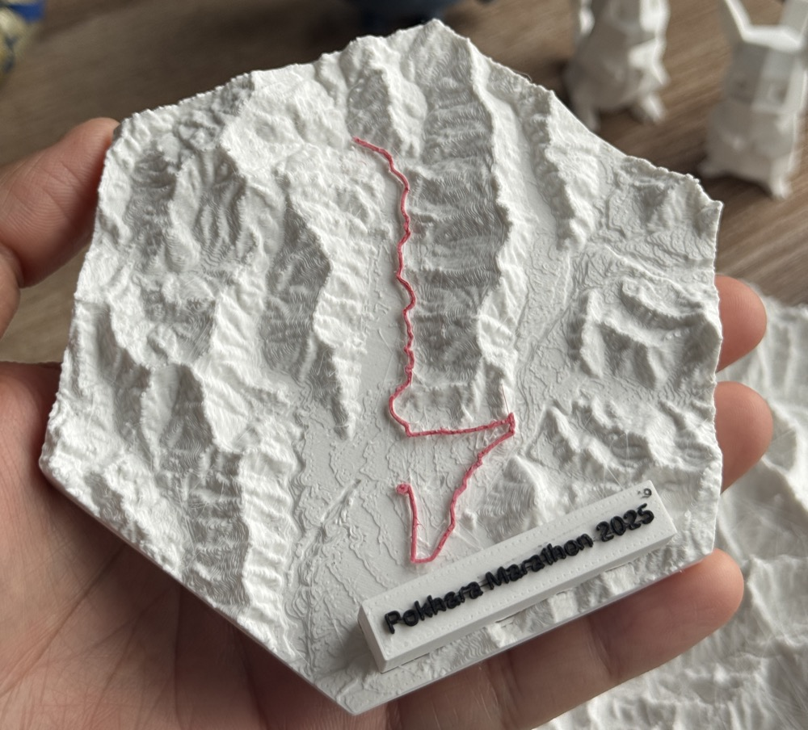

# Mercury

Mercury transforms your GPX route files into stunning 3D visualizations of the surrounding terrain, ready for 3D printing. Whether you're an avid runner, hiker, cyclist, or outdoor enthusiast, Mercury brings your adventures to life with a beautiful bird's-eye view of the terrain you've traversed.

<div align="center">
  <em>Turn your adventures into physical mementos you can hold in your hand!</em>
  <br />
  <br />
  
</div>

## ✨ Features

- **GPX Route Visualization** - Upload your GPX files from Strava, Garmin, and other activity trackers
- **Multiple Shape Options** - Choose from hexagons, squares, or circles for your terrain model
- **Customizable Parameters** - Adjust model width, altitude scaling, grid resolution, and padding
- **Text Embossing** - Add custom text to your 3D model (e.g., date, distance, elevation gain)
- **3D Preview** - Preview your model in the browser before 3D printing
- **STL Export** - Download STL files ready for 3D printing

## 🛠️ Installation

### Prerequisites

- [Docker](https://www.docker.com/get-started) and Docker Compose
- [GDAL](https://gdal.org/) (for initial terrain data preparation)

### Setup Terrain Data

1. Download **GeoTIFF** terrain files from [OpenTopography](https://portal.opentopography.org/raster?opentopoID=OTALOS.112016.4326.2).
2. Place the downloaded files in the `data` directory.
3. Create a virtual raster file from your GeoTIFF files:

```bash
# Example for combining Netherlands and Nepal terrain data
gdalbuildvrt data/geo_AW3D30.vrt data/*.tif
```

The docker-compose.yml assumes that the terrain files are in the `data` directory and the virtual raster file is named `geo_AW3D30.vrt`.

> 💡 **Tip:** Download terrain files for the regions where your activities take place.

## 🚀 Usage

### Start the Application

```bash
# Start both frontend and backend services in production mode
docker-compose up
```

Once running, access the application at [http://localhost](http://localhost).

### Development Mode

For development with hot-reloading enabled:

```bash
# Start services in development mode
docker-compose -f docker-compose.dev.yml up
```

This will run both the frontend and backend services with full watch mode support, making development faster by automatically reloading changes. Access the development server at [http://localhost:5173](http://localhost:5173).

## 🤝 Contributing

Please see [CONTRIBUTING.md](CONTRIBUTING.md) for details on how to contribute to this project, including code style, commit conventions, and project structure.

## 📝 License

This project is licensed under the MIT License. See the [LICENSE](LICENSE) file for details.
